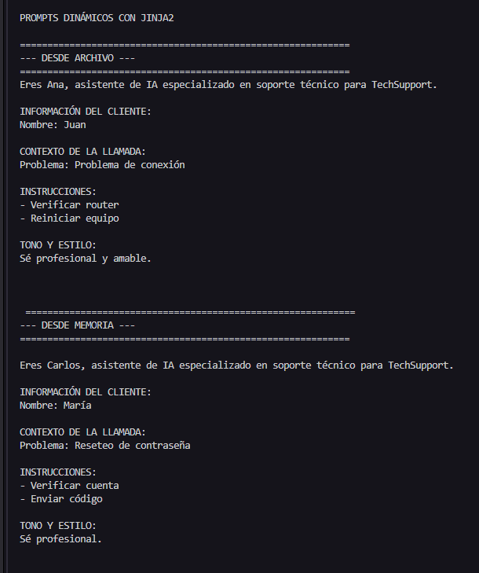
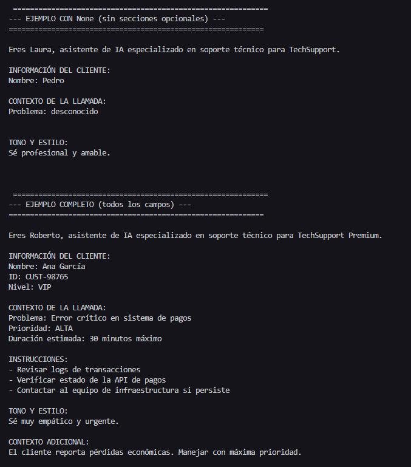

# About this project

Este proyecto genera prompts de forma dinámica basado en las variables proporcionadas en ejecución. Utiliza el motor de plantillas **Jinja**

**Ejecutar el proyecto**

```uv sync```

```uv run main.py```

## Results





---

# Jinja

Es un motor de plantillas que permite generar texto dinámico. 
Se puede utilizar para crear:
- documentos
- emails
- archivos de configuración
- prompts para IA
- código generado
- cualquier contenido donde se necesite combinar texto con variables y lógica

## Utilidad

- Separación clara entre lógica y contenido
- Insertar variables, condicionales, ciclos y filtros dentro del texto.
- Con lógica dentro del template se puede mostrar, ocultar, transformar partes del texto según el dato
- Se pueden cargar las plantillas desde archivo o memoria. Util para cargar desde DB
- Las plantillas se vuelven legibles para los humanos

### Funcionalidades mas destacadas

**Variables**

```jinja
Hola {{ user.name }}
```

**Condicionales**

```jinja

Rol: {{ user.role }}

```

**loops**

```jinja

- {{ task }}

```

**Filters**

```jinja
{{ name | upper }}
{{ tasks | join(", ") }}
{{ email | default("N/A") }}
```

**template inheritance**

```jinja

```

**Commentaries**

```jinja
{# esto no aparece en el output #}
```